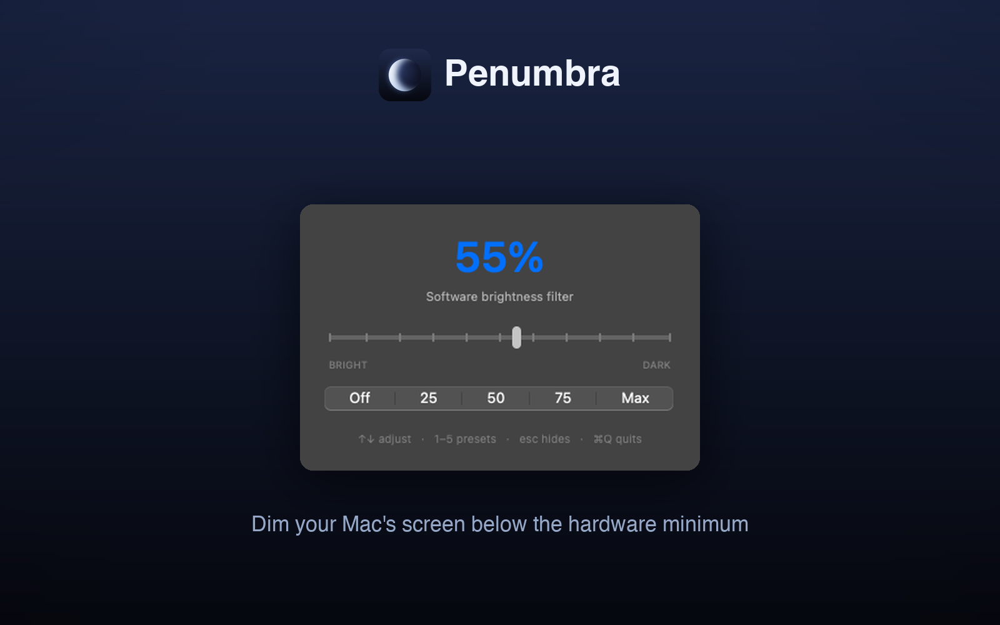

# Penumbra

A macOS screen dimmer that takes your display darker than the hardware minimum.




## The problem

You turn the brightness all the way down at night and the screen is still too
bright. Every Mac has a hardware minimum, and in a dark room that floor is often
painfully luminous. Penumbra fixes that in software.

## What it is

Penumbra lays a smooth, adjustable dark filter over your whole screen, so you can
dim well past the backlight's minimum, all the way down to near black. It lives in
the menu bar and the Dock and stays out of the way: the filter is completely
click-through, so it changes only what you see, never what you can do.

The name is the astronomy term for the soft partial shadow at the edge of an
eclipse, where light is only partly blocked. That is what it does to your screen.

## Features

- Goes darker than the hardware minimum by dimming in software, on top of the
  backlight, down to near black.
- Covers everything: the menu bar, the Dock, and every window, across all displays
  and Spaces, including apps in native full screen (a video in full-screen YouTube
  keeps dimming).
- Click-through, so you keep working normally underneath the filter. Clicks and
  keystrokes pass straight through.
- Precise control with a live percentage, a fine slider, and Off / 25 / 50 / 75 /
  Max presets, plus smooth animated transitions.
- Keyboard driven: arrow keys nudge, number keys jump to presets, Esc hides.
- Remembers your last level and window position between launches.
- Never goes fully black (max is 92%), and the cursor is never dimmed, so you can
  always find your way back.
- Small and native: one menu-bar app built on AppKit, with no kernel extensions,
  no background services, and no telemetry.

## Install

Penumbra runs on Python and [PyObjC](https://pyobjc.readthedocs.io) (the AppKit
bridge), so there is nothing to compile.

```bash
git clone https://github.com/molanocortes/penumbra-screen-dimmer.git
cd penumbra-screen-dimmer
./build_app.sh                 # builds and installs Penumbra.app to /Applications
open /Applications/Penumbra.app
```

If you see a "needs PyObjC" alert, install it into any Python 3 and reopen:

```bash
python3 -m pip install pyobjc-framework-Cocoa
```

Then launch Penumbra from Launchpad or Spotlight. It lives in the menu bar rather
than the Dock (see How it works). To start it automatically, add it under
System Settings > General > Login Items.

## Usage

Opening the app shows a small control window and a crescent menu-bar icon:

- Slider: drag from Bright to Dark.
- Presets: Off / 25 / 50 / 75 / Max.
- Click the crescent menu-bar icon any time to bring the window back. Launching
  the app again does the same thing.

| Key | Action |
|-----|--------|
| Up / Down (or Left / Right) | Nudge brighter or darker |
| 1 to 5 | Jump to Off / 25 / 50 / 75 / Max |
| Esc | Hide the window (dimming stays on) |
| Cmd-Q | Quit (removes the filter) |

## Requirements

- macOS 13 (Ventura) or later
- A Python 3 with PyObjC (`pip install pyobjc-framework-Cocoa` if needed)

## How it works

Penumbra creates one borderless, click-through black window per display, at
`NSScreenSaverWindowLevel`, so it covers the menu bar, the Dock, and every window.
Dimming is the opacity of those windows, animated with `NSAnimationContext`.
Because the filter sits on top of the hardware backlight, it can push the
perceived brightness far below the backlight's own minimum. Settings live in a
small JSON file at `~/Library/Application Support/Penumbra/settings.json`.

Covering an app that is in native full screen takes two separate things, and the
window level is only one of them. A full-screen app gets its own Space, and
whether an overlay may join that Space is decided by the collection behaviour
(`canJoinAllSpaces` + `fullScreenAuxiliary`) together with the process's
activation policy. A regular Dock app is not allowed to float over another app's
full-screen Space at any window level, so Penumbra runs as an accessory
(menu-bar-only) app: that is the reason it has no persistent Dock icon. The
privilege is fixed when a window is created, so the policy is set before any
window is built. Because macOS can also demote a window while Spaces change,
level and collection behaviour are re-applied on every Space change.

### Limits

An overlay cannot cover everything, and this one does not pretend to:

- Apps that take the display with `CGDisplayCapture` or true exclusive full screen
  (some games) draw above any window.
- The screensaver and the login window are off limits to all apps, by design,
  since macOS 10.13.
- At screen-saver level the filter also dims the volume and brightness HUD and
  notification banners. For a whole-screen dimmer that is arguably right, but it
  is worth knowing.
- DRM video (Netflix, Apple TV+) blocks screen *capture*, not covering, so it
  still dims normally.

If you need something that survives even the cases above, the other technique is
the f.lux one: adjust the display gamma tables
(`CGSetDisplayTransferByFormula`) instead of covering pixels. That reaches
everything an overlay cannot, at the cost of touching the whole display pipeline.

## Building and customizing

Edit `penumbra.py` to change behavior (for example `MAX_ALPHA` for the darkest
level, or the preset values), then run `./build_app.sh`.

Regenerate the app icon and the menu-bar glyph with:

```bash
python3 make_icon.py && iconutil -c icns AppIcon.iconset -o AppIcon.icns
```

`Sources/main.swift` is an optional, dependency-free AppKit port; build it with
`./build.sh`.

## Contributing

Issues and pull requests are welcome. Please keep changes focused and match the
existing style. For UI or behavior changes, a short before-and-after screenshot
helps.

## License

[MIT](LICENSE), copyright 2026 Sebastian Molano.

## Author

Made by Sebastian Molano ([@molanocortes](https://github.com/molanocortes)).
